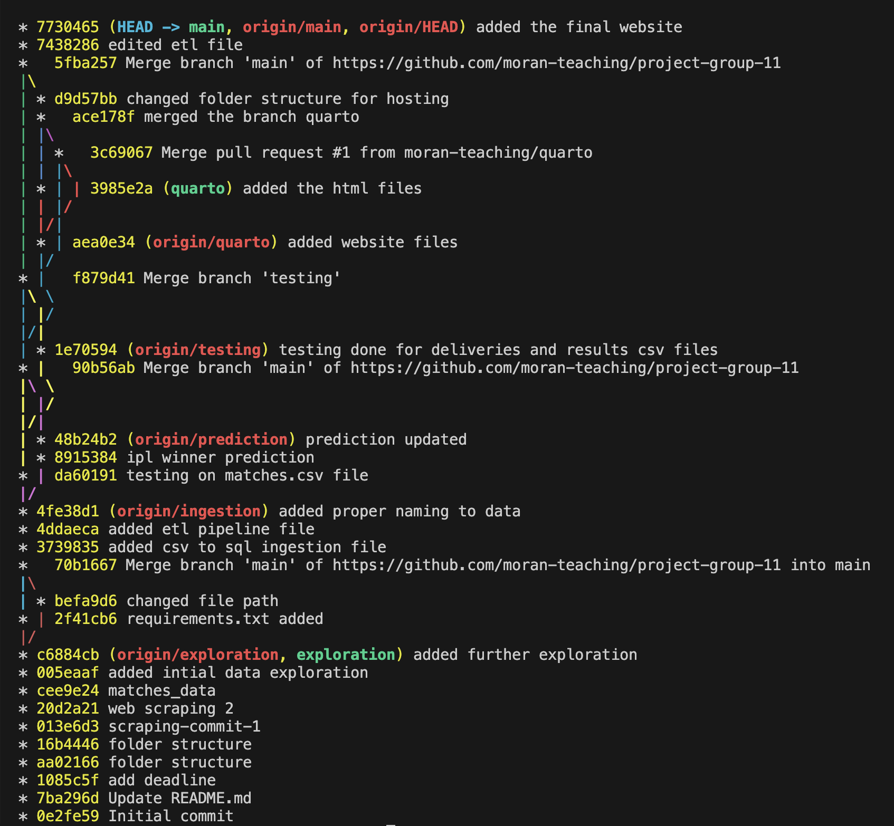

# IPL Data Analytics and Winner Prediction    

---

## 📝 Project Summary  
Our project summary can be found:

🌐 As a website:
  https://moran-teaching.github.io/project-group-11/

---

## 📁 Accessing Data  

**Raw data** can be downloaded from:  
  https://drive.google.com/drive/folders/1sE8S5mS8bM4Kw_YA5NQc41rrjijIg-2F?usp=sharing

**Processed data** (with cleaning + enrichment) can be downloaded from:  
  https://drive.google.com/drive/folders/1-HWQ-XkcbVhxikVW3IrW-BegJw4lBkkL?usp=sharing

---

## 🧠 Python Scripts / Notebooks  

The following scripts and notebooks were used to produce our data analysis, enrichment, and predictions. The code is organized into modular folders as follows:

### 📁 `EDA/`
- `EDA1.ipynb`, `EDA2.ipynb`  
  ➤ Perform exploratory data analysis on team performance, venue trends, and win/loss patterns.  
  ➤ Includes summary statistics, grouped visualizations, and grid-based plots.

### 📁 `Ingestion/`
- `csvtosqlite.py`  
  ➤ Converts cleaned CSVs into SQLite format for structured querying.  
- `etl.py`  
  ➤ Contains the full ETL pipeline: load raw data, clean, enrich, and export for modeling.

### 📁 `prediction/`
- `win_predictor.py`  
  ➤ Predicts the IPL 2025 winner using logistic regression.  
  ➤ Uses historical win ratios and the 2025 points table (scraped or manually input).  
  ➤ Outputs sorted probabilities for all teams and identifies the most likely winner.

### 📁 `testing/`
- `test_match_data.py`  
- `test_deliveries_data.py`  
- `test_results_data.py`  
  ➤ Each script uses `pytest` to validate:
    - Correct team names and venue names  
    - Valid innings numbers  
    - Presence of essential columns  
    - Consistency of types and value ranges

### 📁 `web_scraping/`
- `runs_scraper.py`, `wickets_scraper.py`  
  ➤ Scrape individual player stats and team performance from Cricbuzz.  
  ➤ Used for building enriched datasets (e.g., strike rates, 100s, bowling averages).


---

## 📝 Project Summary  

This project aims to perform end-to-end data wrangling, exploratory analysis, enrichment, and predictive modeling on Indian Premier League (IPL) match data.

We worked with match-level and delivery-level datasets spanning from 2008 to 2024, and manually scraped 2025 points table data from Cricbuzz.

The key goals of our project were:

- ✅ Convert raw scraped data into a clean, analyzable format
- ✅ Standardize and enrich the dataset with useful features (e.g., win ratio, strike rates, centuries)
- ✅ Visualize historical performance trends by team, venue, and season
- ✅ Train a logistic regression model on past seasons to predict the 2025 IPL champion
- ✅ Implement data validation tests using `pytest` to ensure data quality
- ✅ Build an interactive and reproducible pipeline using Python notebooks, scripts, and visualizations

The project involved building a custom ETL pipeline, cleaning inconsistent team/venue names, aggregating win/loss ratios by season, and using machine learning to predict the most likely winner for IPL 2025 based on current team performance.



Interactive 

Key deliverables include a Quarto website with summary dashboards, a Jupyter notebook hosted via nbviewer, and a set of Python scripts to automate scraping, modeling, and visualization.

We hope this work demonstrates how a wrangled and enriched sports dataset can drive predictive insights, even when sourced from inconsistent or semi-structured data.


---

## 📌 Guide: Summary

- **Data origin:** scraped from Cricbuzz, cleaned and standardized in Python
- **Retrieval:** web scraping (Selenium + BeautifulSoup), CSV loading
- **Transformation:** raw to tidy tabular, team/venue renaming, handling missing data
- **Validation:** pytest checks for team names, columns, innings limits
- **Enrichment:** win ratios, strike rates, centuries added
- **EDA:** bar charts, grouped plots, venue analysis, grid layouts
- **Prediction:** logistic regression model trained on past data, predicts IPL 2025 champion
- **Interactive:** `itables` + `plotly` widgets for visual inspection
- **Commit history:** 20+ clean commits across contributors, traceable via Git Graph


---
## 🔁 Reproducibility  

Create a python environment of version 3.10

Run all analyses using:  
```bash
pip install -r requirements.txt
